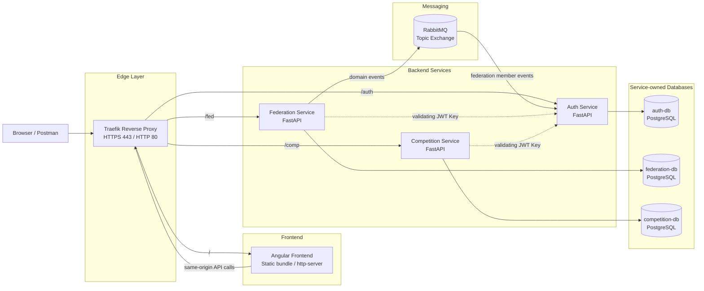
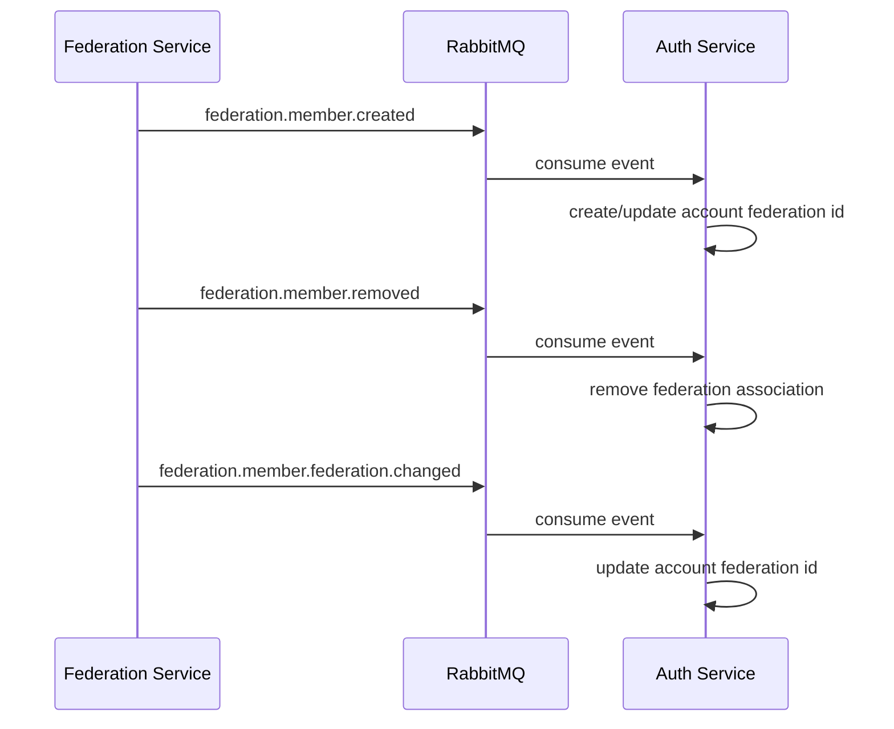

# Distributed Swimming Platform Architecture Documentation

## 1. Overview

The platform uses a **distributed service-based architecture**. The backend is split into independent services, and each service owns a specific business domain.

The main design rule is:

> A service owns its own data and exposes behavior through its own API. Other services must not access its database directly.

The system is composed of:

| Component | Role |
|---|---|
| **Traefik** | Public reverse proxy, HTTPS entry point, path-based routing, TLS termination, and dashboard exposure. |
| **Auth Service** | Authentication, users, sessions, JWT tokens, login history, and account administration. |
| **Federation Service** | Federation members, swimming teams, swimming pools, and member/team lifecycle. |
| **Competition Service** | Swim meetings, swim events, entries, results, and meeting referee assignments. |
| **RabbitMQ** | Asynchronous message broker for service-to-service events. |
| **PostgreSQL** | One database per backend service. |
| **Portainer** | Container management UI. |

The architecture combines:

- **HTTP APIs** for synchronous requests from the frontend or from service to service;
- **RabbitMQ events** for asynchronous domain notifications;
- **JWT access tokens** for stateless authentication and authorization;
- **Service-owned PostgreSQL databases** to keep domain boundaries clear.

---

## 2. High-level architecture



---

## 3. Backend Deployment model

The platform is deployed with Docker Compose. The `deploy.sh` script loads the backend environment files, then runs `deploy.py` to resolve all compose files and start the containers.

The deployment includes these compose files:

| Compose file | Purpose |
|---|---|
| `Frontend/docker-compose.yml` | Angular frontend served behind Traefik. |
| `docker-compose.traefik.yml` | Traefik reverse proxy and `whoami` test service. |
| `docker-compose.portainer.yml` | Portainer container-management UI. |
| `docker-compose.rabbitmq.yml` | RabbitMQ broker and RabbitMQ Management UI. |
| `docker-compose.auth.yml` | Auth Service and Auth PostgreSQL database. |
| `docker-compose.federation.yml` | Federation Service and Federation PostgreSQL database. |
| `docker-compose.competition.yml` | Competition Service and Competition PostgreSQL database. |

### Deployment commands

```bash
./deploy.sh setup
./deploy.sh start
./deploy.sh down
./deploy.sh remove
```

| Command | Meaning |
|---|---|
| `setup` | Generates local TLS certificates, Traefik TLS configuration, JWT RSA keys and the shared Docker network. |
| `start` | Runs setup and starts all containers with Docker Compose. |
| `down` | Stops and removes containers while preserving volumes. |
| `remove` | Stops containers and removes volumes. |

---

## 4. Network architecture

The deployment uses one shared network and one private network per backend service.

| Network | Used by | Purpose |
|---|---|---|
| `service-mesh-net` | Traefik, Angular Frontend, RabbitMQ, Portainer, Auth Service, Federation Service, Competition Service | Shared network for public routing and internal service reachability. |
| `auth-net` | Auth Service, `auth-db` | Private database network for Auth Service. |
| `federation-net` | Federation Service, `federation-db` | Private database network for Federation Service. |
| `competition-net` | Competition Service, `competition-db` | Private database network for Competition Service. |

Each database is attached only to its owning service network. This prevents other services from bypassing the owning service API.

---

## 5. Public URLs and service paths

Traefik is the public entry point. It exposes infrastructure services and routes backend traffic based on the request hostname and path prefix.

### Infrastructure URLs

| Component | URL |
|---|---|
| Angular frontend | `https://app.docker.localhost` |
| Traefik dashboard | `https://dashboard.docker.localhost/dashboard/` |
| Whoami test service | `https://whoami.docker.localhost` |
| Portainer | `https://portainer.docker.localhost` |
| RabbitMQ Management UI | `https://rabbitmq.docker.localhost` |

### Backend service paths and URLs

| Backend service | Public path prefix | Public base URL | Internal container port |
|---|---:|---|---:|---|
| **Auth Service** | `/auth` | `https://app.docker.localhost/auth` | `8000` |
| **Federation Service** | `/fed` | `https://app.docker.localhost/fed` | `8001` | 
| **Competition Service** | `/comp` | `https://app.docker.localhost/comp` | `8002` |

### Documentation URLs

The documentation for the REST API endpoints can be found at the following path:

| Service | Swagger UI | OpenAPI JSON |
|---|---|---|
| Auth Service | `https://app.docker.localhost/auth/docs` | `https://app.docker.localhost/auth/openapi.json` |
| Federation Service | `https://app.docker.localhost/fed/docs` | `https://app.docker.localhost/fed/openapi.json` |
| Competition Service | `https://app.docker.localhost/comp/docs` | `https://app.docker.localhost/comp/openapi.json` |

---

## 6. Service domain responsibilities

This section describes the business responsibility of each backend service. The goal is to define **what each service owns** and **what it should not own**.


### 6.1 Auth Service

#### Service identity

| Item | Value |
|---|---|
| Public path | `/auth` |
| Public URL | `https://app.docker.localhost/auth` |
| Database | `auth-db` |
| Private network | `auth-net` |
| Shared network | `service-mesh-net` |
| Framework | FastAPI |

#### Domain responsibilities

The Auth Service owns the **identity and access domain**. It is the source of truth for platform accounts, authentication, and sessions management.

Main responsibilities:

- manage accounts, credentials, account status, and platform roles;
- authenticate users, issue JWTs, and expose public keys for token validation;
- manage refresh tokens, logout, session rotation, and revocation;
- store security audit data and synchronize federation references through events.

---

### 6.2 Federation Service

#### Service identity

| Item | Value |
|---|---|
| Public path | `/fed` |
| Public URL | `https://app.docker.localhost/fed` |
| Database | `federation-db` |
| Private network | `federation-net` |
| Shared network | `service-mesh-net` |
| Framework | FastAPI |

#### Domain responsibilities

The Federation Service owns the **federation registry domain**. It is the source of truth for federation members and swimming-organization data.

Main responsibilities:

- manage federation members and federation roles such as athletes, coach and referees;
- manage swimming teams and team membership;
- manage swimming pools and their association with teams;
- publish member lifecycle events.

---

### 6.3 Competition Service

#### Service identity

| Item | Value |
|---|---|
| Public path | `/comp` |
| Public URL | `https://app.docker.localhost/comp` |
| Database | `competition-db` |
| Private network | `competition-net` |
| Shared network | `service-mesh-net` |
| Framework | FastAPI |

#### Domain responsibilities

The Competition Service owns the **competition and race-management domain**. It is the source of truth for meetings, events, entries, and results management.

Main responsibilities:

- manage swim meetings and their lifecycle;
- manage swim events, athlete entries, and race results;
- assign referees to meetings and enforce result-insertion authorization;

---

## 7. Domain responsibility matrix

| Domain capability | Auth Service | Federation Service | Competition Service |
|---|---:|---:|---:|
| User login | Owns | Does not own | Does not own |
| Password hashing | Owns | Does not own | Does not own |
| Refresh tokens | Owns | Does not own | Does not own |
| JWT signing | Owns | Does not own | Does not own |
| JWT validation | Owns source keys | Validates | Validates |
| Platform accounts | Owns | References through events | References through JWT |
| Federation members | Stores reference only | Owns | References by federation id |
| Federation roles | Uses in token/authorization | Owns domain role | Uses for access checks if available |
| Swimming teams | Does not own | Owns | References organizer team id |
| Swimming pools | Does not own | Owns | References pool id |
| Swim meetings | Does not own | Does not own | Owns |
| Swim events | Does not own | Does not own | Owns |
| Event entries | Does not own | Does not own | Owns |
| Race results | Does not own | Does not own | Owns |
| Meeting referees | Does not own | Defines referee identity | Owns assignment to meetings |
| Login attempts | Owns | Does not own | Does not own |
| Domain events | Consumes federation events | Publishes federation events | May consume/use events later |

---

## 8. Service-to-service communication

The services communicate in two ways.

### Synchronous communication

HTTP is used when a service or frontend needs an immediate response.

Examples:

- the frontend calls Auth Service to login;
- the frontend calls Federation Service to list athletes;
- the frontend calls Competition Service to list meetings;
- backend services can retrieve JWT validation key from the Authentication Service.

### Asynchronous communication

RabbitMQ is used when one service publishes a domain fact and another service reacts to it.

The current event flow is:



### RabbitMQ configuration

| Item | Description |
|---|---|
| Broker | RabbitMQ with management UI. |
| Public UI | `https://rabbitmq.docker.localhost` |
| Network | `service-mesh-net` |
| Federation exchange | Configured by `FEDERATION_EVENTS_EXCHANGE`. |
| Auth consumer queue | Configured by `AUTH_FEDERATION_QUEUE`. |
| Event style | Topic exchange with routing keys. |

RabbitMQ allows the Federation Service to publish events without knowing the internal implementation of Auth Service. Auth Service consumes the queue and updates its own database.

---

## 9. Authentication and authorization model

### Access token

The Auth Service issues JWT access tokens. Other services validate the token using the public key exposed by Auth Service.

The token carries the identity information needed by the other services, such as:

- user id;
- platform role;
- federation id, when available;
- expiration time.

### Refresh token

Refresh tokens are stored server-side and sent to the client as an HTTP-only cookie. This means the frontend does not manually read the refresh token.

### Role usage

The system separates:

- **platform roles**, such as admin or default user;
- **federation roles**, such as athlete, coach, referee, or manager.

The platform role is owned by Auth Service. Federation roles are owned by Federation Service. Other services can use token claims and domain references to enforce local authorization rules.

Admins may have broader access depending on endpoint rules.

---

## 10. Data ownership boundaries

Each backend service has its own PostgreSQL database.

| Service | Database | Owns |
|---|---|---|
| Auth Service | `auth-db` | Users, passwords, sessions, tokens, account status, login attempts. |
| Federation Service | `federation-db` | Members, teams, pools, federation roles, member-team association. |
| Competition Service | `competition-db` | Meetings, events, entries, results. |

---

## 12. Frontend integration summary

The Angular frontend is served through Traefik at `https://app.docker.localhost` and calls the backend with same-origin relative paths.

| Domain | Service | Base URL |
|---|---|---|
| Authentication and users | Auth Service | `/auth` |
| Federation members, teams, pools | Federation Service | `/fed` |
| Meetings, events, entries, results | Competition Service | `/comp` |

Recommended frontend service split:

| Angular service | Backend domain |
|---|---|
| `Services/AuthService/api` | Login, logout, refresh, current user, accounts. |
| `Services/FederationService/api` | Athletes, coaches, referees, teams, pools, federation members. |
| `Services/CompetitionService/api` | Meetings, competitions, events, entries, results, referee assignments. |

Authenticated frontend requests should send:

```http
Authorization: Bearer <accessToken>
```

Refresh and logout calls should use credentials/cookies if the refresh token is stored as an HTTP-only cookie.

---

## 13. Operational notes

### Local DNS

If local DNS resolution does not work, add these entries to `/etc/hosts`:

```text
127.0.0.1 dashboard.docker.localhost
127.0.0.1 whoami.docker.localhost
127.0.0.1 portainer.docker.localhost
127.0.0.1 rabbitmq.docker.localhost
127.0.0.1 app.docker.localhost
```

### TLS

The deployment script generates a local wildcard certificate for:

```text
*.docker.localhost
```

The generated certificate is mounted into Traefik through the dynamic TLS configuration.

### Health checks

Each backend service exposes a local health endpoint used by Docker health checks. PostgreSQL containers use `pg_isready`. RabbitMQ uses `rabbitmq-diagnostics ping`.


---
